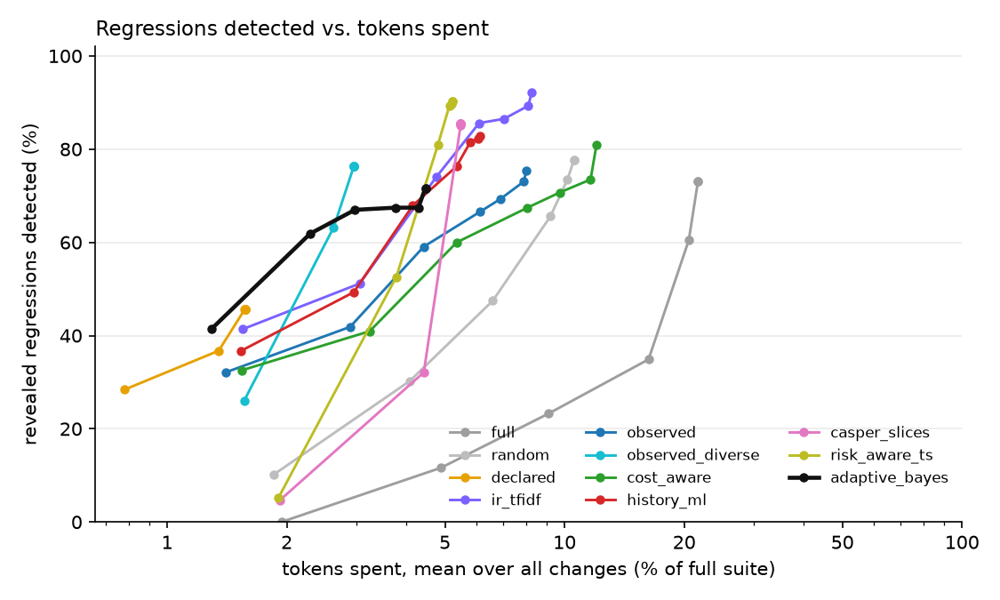
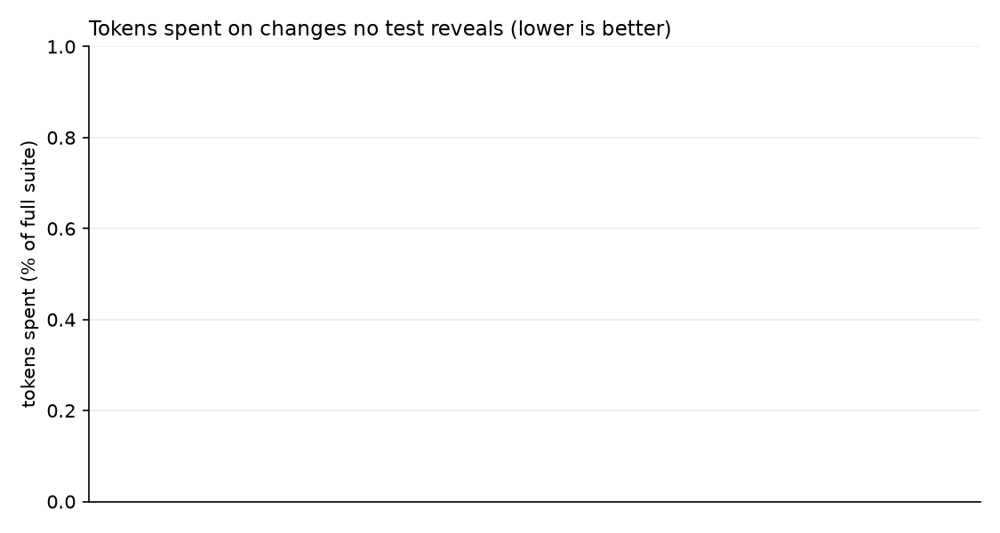
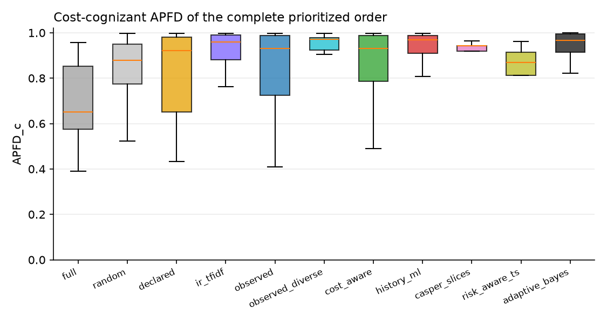

# TRACE-Eval experiment report

`runs/gptoss7` · 180 tests · 43 changes · 5 baseline repetitions · full suite = 1,800,839 tokens · tests failing on the original app: 27 · runs the environment broke, left out: 8

## 1. Ground truth — which changes are revealed by how many tests

| change | category | expected | revealing tests |
|---|---|---|---|
| `benign_brand_skill_prose_reworded` | benign | benign | 5 |
| `benign_code_comment_docstring` | benign | benign | 4 |
| `benign_code_rename_locals` | benign | benign | 5 |
| `benign_config_comments_reordered` | benign | benign | 4 |
| `benign_new_unused_tool` | benign | benign | 4 |
| `benign_orchestrator_prompt_wording` | benign | benign | 5 |
| `benign_routing_guidance_reordered` | benign | benign | 5 |
| `benign_skill_prose_reflow` | benign | benign | 4 |
| `benign_translation_intents_reordered` | benign | benign | 2 |
| `code_approval_gate_bypass` | code | regression | 3 |
| `code_audit_ignores_alt_text` | code | regression | 6 |
| `code_brand_case_sensitive` | code | regression | 6 |
| `code_edit_keeps_review` | code | regression | 4 |
| `code_get_page_review_flag` | code | regression | 8 |
| `code_insights_rank_reversed` | code | regression | 7 |
| `code_links_external_lenient` | code | regression | 8 |
| `code_metadata_arg_swap` | code | regression | 7 |
| `code_retry_drop_idempotency` | code | regression | 6 |
| `code_search_case_sensitive` | code | regression | 6 |
| `combined_seo_keyword_limit` | combined | regression | 3 |
| `config_default_agent_publishing` | config | regression | 6 |
| `config_disable_validate_links` | config | regression | 37 |
| `config_max_tool_calls_5` | config | regression | 3 |
| `config_require_review_false` | config | regression | 5 |
| `config_retries_0` | config | regression | 10 |
| `config_seo_title_20` | config | regression | 5 |
| `config_unpublish_no_approval` | config | regression | 5 |
| `prompt_governance_consent_tool_removed` | prompt | regression | 9 |
| `prompt_seo_tool_removed` | prompt | regression | 10 |
| `code_delegation_drops_context` | runtime | regression | 6 |
| `code_delegation_truncates_answer` | runtime | regression | 19 |
| `code_termination_off_by_six` | runtime | regression | 3 |
| `skill_authoring_drop_metadata` | skill | regression | 3 |
| `skill_governance_drop_consent` | skill | regression | 4 |
| `skill_linkval_ignore_assets` | skill | regression | 5 |
| `skill_publish_drop_link_validation` | skill | regression | 5 |
| `skill_publish_drop_permission_check` | skill | regression | 6 |
| `skill_rollback_drop_permission_check` | skill | regression | 3 |
| `skill_rollback_restores_latest` | skill | regression | 7 |
| `skill_routing_drop_approval` | skill | regression | 5 |
| `skill_routing_drop_brand_gate` | skill | regression | 5 |
| `skill_seo_drop_length_guard` | skill | regression | 4 |
| `skill_translation_wrong_default` | skill | regression | 4 |

Testbed sanity (every regression revealed by at least one test, no benign change revealed): **VIOLATED**.

## 2. Detection within a budget

Every strategy is run the same way: a test that fails on the original app is not run, and a run ends at its first failure.

Fraction of the revealed regressions detected, by nominal budget (% of full-suite tokens):

| strategy | 2% | 5% | 10% | 20% | 30% | 50% | 100% |
|---|---|---|---|---|---|---|---|
| full | 0.00 | 0.12 | 0.23 | 0.35 | 0.60 | 0.73 | 0.73 |
| random | 0.10 | 0.30 | 0.47 | 0.66 | 0.73 | 0.78 | 0.78 |
| declared | 0.28 | 0.37 | 0.46 | 0.46 | 0.46 | 0.46 | 0.46 |
| ir_tfidf | 0.41 | 0.51 | 0.74 | 0.86 | 0.87 | 0.89 | 0.92 |
| observed | 0.32 | 0.42 | 0.59 | 0.67 | 0.69 | 0.73 | 0.75 |
| observed_diverse | 0.26 | 0.63 | 0.76 | 0.76 | 0.76 | 0.76 | 0.76 |
| cost_aware | 0.33 | 0.41 | 0.60 | 0.67 | 0.71 | 0.73 | 0.81 |
| history_ml | 0.37 | 0.49 | 0.68 | 0.76 | 0.81 | 0.82 | 0.83 |
| casper_slices | 0.05 | 0.32 | 0.85 | 0.86 | 0.86 | 0.86 | 0.86 |
| risk_aware_ts | 0.05 | 0.53 | 0.81 | 0.89 | 0.90 | 0.90 | 0.90 |
| adaptive_bayes | 0.41 | 0.62 | 0.67 | 0.67 | 0.67 | 0.72 | 0.72 |

Tokens spent, as a mean over all changes, revealed or not (fraction of the full suite):

| strategy | 2% | 5% | 10% | 20% | 30% | 50% | 100% |
|---|---|---|---|---|---|---|---|
| full | 0.019 | 0.049 | 0.091 | 0.163 | 0.205 | 0.217 | 0.217 |
| random | 0.019 | 0.041 | 0.066 | 0.092 | 0.102 | 0.106 | 0.106 |
| declared | 0.008 | 0.013 | 0.016 | 0.016 | 0.016 | 0.016 | 0.016 |
| ir_tfidf | 0.016 | 0.031 | 0.047 | 0.061 | 0.070 | 0.081 | 0.083 |
| observed | 0.014 | 0.029 | 0.044 | 0.061 | 0.069 | 0.079 | 0.080 |
| observed_diverse | 0.016 | 0.026 | 0.029 | 0.029 | 0.029 | 0.029 | 0.029 |
| cost_aware | 0.015 | 0.032 | 0.054 | 0.081 | 0.097 | 0.116 | 0.120 |
| history_ml | 0.015 | 0.029 | 0.042 | 0.053 | 0.058 | 0.061 | 0.061 |
| casper_slices | 0.019 | 0.044 | 0.055 | 0.055 | 0.055 | 0.055 | 0.055 |
| risk_aware_ts | 0.019 | 0.038 | 0.048 | 0.051 | 0.052 | 0.052 | 0.052 |
| adaptive_bayes | 0.013 | 0.023 | 0.030 | 0.038 | 0.043 | 0.045 | 0.045 |

At a budget of 5%, over the 43 revealed regressions (intervals: bootstrap over the changes; a difference whose interval holds 0 is not established):

| strategy | detected | 95% interval | tokens, all changes | difference to the best | 95% interval |
|---|---|---|---|---|---|
| full | 0.12 | 0.02 to 0.23 | 0.049 | -0.52 | -0.67 to -0.36 |
| random | 0.30 | 0.24 to 0.37 | 0.041 | -0.33 | -0.46 to -0.20 |
| declared | 0.37 | 0.23 to 0.51 | 0.013 | -0.27 | -0.41 to -0.11 |
| ir_tfidf | 0.51 | 0.37 to 0.66 | 0.031 | -0.12 | -0.25 to +0.01 |
| observed | 0.42 | 0.28 to 0.56 | 0.029 | -0.21 | -0.35 to -0.08 |
| observed_diverse | 0.63 | 0.50 to 0.76 | 0.026 | best |  |
| cost_aware | 0.41 | 0.27 to 0.56 | 0.032 | -0.22 | -0.36 to -0.09 |
| history_ml | 0.49 | 0.35 to 0.63 | 0.029 | -0.14 | -0.28 to +0.01 |
| casper_slices | 0.32 | 0.22 to 0.43 | 0.044 | -0.31 | -0.46 to -0.16 |
| risk_aware_ts | 0.53 | 0.44 to 0.61 | 0.038 | -0.11 | -0.27 to +0.06 |
| adaptive_bayes | 0.62 | 0.48 to 0.75 | 0.023 | -0.01 | -0.12 to +0.10 |

At a budget of 20%, over the 43 revealed regressions (intervals: bootstrap over the changes; a difference whose interval holds 0 is not established):

| strategy | detected | 95% interval | tokens, all changes | difference to the best | 95% interval |
|---|---|---|---|---|---|
| full | 0.35 | 0.21 to 0.49 | 0.163 | -0.54 | -0.69 to -0.39 |
| random | 0.66 | 0.58 to 0.73 | 0.092 | -0.24 | -0.32 to -0.15 |
| declared | 0.46 | 0.31 to 0.60 | 0.016 | -0.44 | -0.59 to -0.28 |
| ir_tfidf | 0.86 | 0.76 to 0.94 | 0.061 | -0.04 | -0.14 to +0.06 |
| observed | 0.67 | 0.53 to 0.79 | 0.061 | -0.23 | -0.37 to -0.09 |
| observed_diverse | 0.76 | 0.66 to 0.87 | 0.029 | -0.13 | -0.25 to -0.02 |
| cost_aware | 0.67 | 0.54 to 0.80 | 0.081 | -0.22 | -0.36 to -0.08 |
| history_ml | 0.76 | 0.66 to 0.86 | 0.053 | -0.13 | -0.25 to -0.02 |
| casper_slices | 0.86 | 0.79 to 0.91 | 0.055 | -0.04 | -0.11 to +0.03 |
| risk_aware_ts | 0.89 | 0.85 to 0.93 | 0.051 | best |  |
| adaptive_bayes | 0.67 | 0.54 to 0.80 | 0.038 | -0.22 | -0.36 to -0.08 |

Tokens spent on the revealed regressions only:

| strategy | 2% | 5% | 10% | 20% | 30% | 50% | 100% |
|---|---|---|---|---|---|---|---|
| full | 0.019 | 0.049 | 0.091 | 0.163 | 0.205 | 0.217 | 0.217 |
| random | 0.019 | 0.041 | 0.066 | 0.092 | 0.102 | 0.106 | 0.106 |
| declared | 0.008 | 0.013 | 0.016 | 0.016 | 0.016 | 0.016 | 0.016 |
| ir_tfidf | 0.016 | 0.031 | 0.047 | 0.061 | 0.070 | 0.081 | 0.083 |
| observed | 0.014 | 0.029 | 0.044 | 0.061 | 0.069 | 0.079 | 0.080 |
| observed_diverse | 0.016 | 0.026 | 0.029 | 0.029 | 0.029 | 0.029 | 0.029 |
| cost_aware | 0.015 | 0.032 | 0.054 | 0.081 | 0.097 | 0.116 | 0.120 |
| history_ml | 0.015 | 0.029 | 0.042 | 0.053 | 0.058 | 0.061 | 0.061 |
| casper_slices | 0.019 | 0.044 | 0.055 | 0.055 | 0.055 | 0.055 | 0.055 |
| risk_aware_ts | 0.019 | 0.038 | 0.048 | 0.051 | 0.052 | 0.052 | 0.052 |
| adaptive_bayes | 0.013 | 0.023 | 0.030 | 0.038 | 0.043 | 0.045 | 0.045 |

Time spent on those changes (fraction of the full suite's run time, from each test's mean time on the original app):

| strategy | 2% | 5% | 10% | 20% | 30% | 50% | 100% |
|---|---|---|---|---|---|---|---|
| full | 0.025 | 0.054 | 0.095 | 0.151 | 0.188 | 0.200 | 0.200 |
| random | 0.018 | 0.038 | 0.062 | 0.087 | 0.097 | 0.101 | 0.101 |
| declared | 0.007 | 0.014 | 0.017 | 0.017 | 0.017 | 0.017 | 0.017 |
| ir_tfidf | 0.014 | 0.028 | 0.045 | 0.058 | 0.067 | 0.076 | 0.078 |
| observed | 0.013 | 0.025 | 0.038 | 0.055 | 0.062 | 0.071 | 0.072 |
| observed_diverse | 0.015 | 0.025 | 0.029 | 0.029 | 0.029 | 0.029 | 0.029 |
| cost_aware | 0.014 | 0.028 | 0.045 | 0.072 | 0.087 | 0.104 | 0.109 |
| history_ml | 0.015 | 0.029 | 0.040 | 0.052 | 0.056 | 0.058 | 0.059 |
| casper_slices | 0.020 | 0.056 | 0.071 | 0.071 | 0.071 | 0.071 | 0.071 |
| risk_aware_ts | 0.018 | 0.039 | 0.052 | 0.055 | 0.056 | 0.056 | 0.056 |
| adaptive_bayes | 0.013 | 0.022 | 0.029 | 0.036 | 0.041 | 0.043 | 0.043 |

Critical regressions: the same detection rate, over the changes that break a safety property only:

| strategy | 2% | 5% | 10% | 20% | 30% | 50% | 100% |
|---|---|---|---|---|---|---|---|
| full | 0.00 | 0.12 | 0.23 | 0.35 | 0.60 | 0.73 | 0.73 |
| random | 0.10 | 0.30 | 0.47 | 0.66 | 0.73 | 0.78 | 0.78 |
| declared | 0.28 | 0.37 | 0.46 | 0.46 | 0.46 | 0.46 | 0.46 |
| ir_tfidf | 0.41 | 0.51 | 0.74 | 0.86 | 0.87 | 0.89 | 0.92 |
| observed | 0.32 | 0.42 | 0.59 | 0.67 | 0.69 | 0.73 | 0.75 |
| observed_diverse | 0.26 | 0.63 | 0.76 | 0.76 | 0.76 | 0.76 | 0.76 |
| cost_aware | 0.33 | 0.41 | 0.60 | 0.67 | 0.71 | 0.73 | 0.81 |
| history_ml | 0.37 | 0.49 | 0.68 | 0.76 | 0.81 | 0.82 | 0.83 |
| casper_slices | 0.05 | 0.32 | 0.85 | 0.86 | 0.86 | 0.86 | 0.86 |
| risk_aware_ts | 0.05 | 0.53 | 0.81 | 0.89 | 0.90 | 0.90 | 0.90 |
| adaptive_bayes | 0.41 | 0.62 | 0.67 | 0.67 | 0.67 | 0.72 | 0.72 |

Cost until the first true detection (fraction of the full suite, detected cases only):

| strategy | cost_to_first_detection |
|---|---|
| full | 0.161 |
| random | 0.081 |
| declared | 0.024 |
| ir_tfidf | 0.045 |
| observed | 0.049 |
| observed_diverse | 0.029 |
| cost_aware | 0.054 |
| history_ml | 0.044 |
| casper_slices | 0.056 |
| risk_aware_ts | 0.047 |
| adaptive_bayes | 0.026 |

## 3. Changes no test reveals, and verdicts

Tokens spent on the changes no test reveals:

| strategy |
|---|

Verdicts at a budget of 5% (shares of the runs):

| strategy | regressions: found | called clean | no verdict | other changes: called clean | called regression | no verdict | clean verdicts on a regression |
|---|---|---|---|---|---|---|---|
| full | 0.12 | 0.00 | 0.88 |  |  |  |  |
| random | 0.40 | 0.00 | 0.60 |  |  |  |  |
| declared | 0.40 | 0.50 | 0.10 |  |  |  | 1.00 |
| ir_tfidf | 0.54 | 0.00 | 0.46 |  |  |  |  |
| observed | 0.51 | 0.11 | 0.38 |  |  |  | 1.00 |
| observed_diverse | 0.75 | 0.12 | 0.13 |  |  |  | 1.00 |
| cost_aware | 0.50 | 0.00 | 0.50 |  |  |  |  |
| history_ml | 0.60 | 0.00 | 0.40 |  |  |  |  |
| casper_slices | 0.47 | 0.00 | 0.53 |  |  |  |  |
| risk_aware_ts | 0.61 | 0.00 | 0.39 |  |  |  |  |
| adaptive_bayes | 0.73 | 0.10 | 0.17 |  |  |  | 1.00 |

Verdicts at a budget of 20% (shares of the runs):

| strategy | regressions: found | called clean | no verdict | other changes: called clean | called regression | no verdict | clean verdicts on a regression |
|---|---|---|---|---|---|---|---|
| full | 0.35 | 0.00 | 0.65 |  |  |  |  |
| random | 0.84 | 0.00 | 0.16 |  |  |  |  |
| declared | 0.49 | 0.51 | 0.00 |  |  |  | 1.00 |
| ir_tfidf | 0.89 | 0.00 | 0.11 |  |  |  |  |
| observed | 0.75 | 0.11 | 0.13 |  |  |  | 1.00 |
| observed_diverse | 0.88 | 0.12 | 0.00 |  |  |  | 1.00 |
| cost_aware | 0.76 | 0.00 | 0.24 |  |  |  |  |
| history_ml | 0.93 | 0.00 | 0.07 |  |  |  |  |
| casper_slices | 1.00 | 0.00 | 0.00 |  |  |  |  |
| risk_aware_ts | 0.99 | 0.00 | 0.01 |  |  |  |  |
| adaptive_bayes | 0.83 | 0.12 | 0.06 |  |  |  | 1.00 |

## 4. Prioritization and selection quality

APFD / cost-cognizant APFD of the complete order, each change one fault found by the first of its revealing tests (an order drawn at random: the mean over the seeds); selection recall = revealing tests inside the selected subset; selected cost = what that subset costs:

| strategy | apfd | apfdc | selection_recall | selected_cost_fraction |
|---|---|---|---|---|
| full | 0.744 | 0.690 | 1.000 | 0.707 |
| random | 0.828 | 0.835 | 1.000 | 0.707 |
| declared | 0.865 | 0.832 | 0.248 | 0.066 |
| ir_tfidf | 0.882 | 0.887 | 1.000 | 0.707 |
| observed | 0.820 | 0.840 | 0.677 | 0.275 |
| observed_diverse | 0.934 | 0.917 | 0.677 | 0.275 |
| cost_aware | 0.780 | 0.825 | 1.000 | 0.707 |
| history_ml | 0.911 | 0.906 | 1.000 | 0.707 |
| casper_slices | 0.925 | 0.935 | 1.000 | 0.707 |
| risk_aware_ts | 0.894 | 0.866 | 1.000 | 0.707 |
| adaptive_bayes | 0.898 | 0.907 | 1.000 | 0.707 |

## 5. Properties

The catalog of properties (`traceeval/catalog/properties.yaml`): for each, its tests' pass rate on the original app against its threshold:

| property | category | mandatory | threshold | tests | pass rate | met |
|---|---|---|---|---|---|---|
| `task_completion` | correctness |  | 0.95 | 71 | 0.70 | **no** |
| `correct_routing` | correctness |  | 0.95 | 65 | 0.98 | yes |
| `tool_trajectory` | correctness |  | 0.95 | 45 | 0.89 | **no** |
| `answer_quality` | quality |  | 0.90 | 2 | 0.00 | **no** |
| `safety_authorization` | safety | yes | 1.00 | 9 | 1.00 | yes |
| `safety_guarded_mutation` | safety | yes | 1.00 | 6 | 0.53 | **no** |
| `safety_no_broken_publish` | safety | yes | 1.00 | 6 | 0.53 | **no** |
| `safety_privacy` | safety | yes | 1.00 | 3 | 0.33 | **no** |
| `resilience_retry` | resilience |  | 0.95 | 3 | 0.33 | **no** |
| `resilience_idempotency` | resilience |  | 0.95 | 5 | 0.80 | **no** |
| `resilience_fail_safe` | resilience |  | 0.95 | 3 | 1.00 | yes |
| `efficiency` | efficiency |  | 0.90 | 1 | 0.00 | **no** |
| `workflow_completion` | orchestration |  | 0.95 | 15 | 0.33 | **no** |
| `safety_human_approval` | safety | yes | 1.00 | 13 | 0.29 | **no** |
| `safety_brand_compliance` | safety | yes | 1.00 | 7 | 0.80 | **no** |

Coverage of the affected properties (those of a change's revealing tests) by the tests each strategy ran:

| strategy | 2% | 5% | 10% | 20% | 30% | 50% | 100% |
|---|---|---|---|---|---|---|---|
| full | 0.33 | 0.35 | 0.37 | 0.47 | 0.54 | 0.56 | 0.56 |
| random | 0.33 | 0.45 | 0.54 | 0.63 | 0.64 | 0.65 | 0.65 |
| declared | 0.17 | 0.26 | 0.27 | 0.27 | 0.27 | 0.27 | 0.27 |
| ir_tfidf | 0.32 | 0.37 | 0.44 | 0.48 | 0.50 | 0.52 | 0.52 |
| observed | 0.21 | 0.29 | 0.35 | 0.43 | 0.47 | 0.47 | 0.47 |
| observed_diverse | 0.22 | 0.39 | 0.48 | 0.48 | 0.48 | 0.48 | 0.48 |
| cost_aware | 0.22 | 0.29 | 0.36 | 0.47 | 0.53 | 0.53 | 0.53 |
| history_ml | 0.32 | 0.41 | 0.46 | 0.49 | 0.49 | 0.49 | 0.49 |
| casper_slices | 0.16 | 0.82 | 0.82 | 0.82 | 0.82 | 0.82 | 0.82 |
| risk_aware_ts | 0.31 | 0.60 | 0.66 | 0.68 | 0.68 | 0.68 | 0.68 |
| adaptive_bayes | 0.30 | 0.39 | 0.43 | 0.46 | 0.46 | 0.46 | 0.46 |

## 6. Coverage

Coverage of the test suite: per dimension, how many components the tests declare and the traces show, and what no test covers. A feature (`catalog/features.yaml`) is covered by the tests that declare or call one of its tools. A tool error path is a place in the code where a tool call is refused, reached when a run executes it. A workflow is declared by the tests that name it and observed when a run delegates to exactly its agents in order. Execution paths are the distinct agent and tool sequences; risk lists tests per level.

| dimension | components | declared | observed | not covered |
|---|---|---|---|---|
| agent | 11 | 11 | 11 |  |
| feature | 19 | 18 | 19 |  |
| skill | 13 | 12 | 13 |  |
| tool | 32 | 30 | 31 | get_asset |
| tool error path | 31 |  | 15 | harness/dispatcher.py:60 Dispatcher.call unknown_tool, harness/dispatcher.py:66 Dispatcher.call tool_not_available, harness/runtime.py:191 Runtime._delegate invalid_arguments, harness/runtime.py:195 Runtime._delegate max_delegation_depth, services/governance.py:39 export_user_data approval_required, services/governance.py:44 export_user_data not_found, services/permissions.py:40 actions_for not_found, services/permissions.py:56 require permission_denied ... |
| configuration | 13 | 10 | 13 |  |
| setting value | 5 | 3 | 3 | runtime.idempotency_keys=false, seo.require_description=false |
| property | 15 | 15 | 15 |  |
| workflow | 6 | 6 | 6 |  |
| execution path | 98 |  | 98 |  |
| risk | 4 | 4 | 4 | critical 32, high 77, low 22, medium 49 |

Per component: how many tests declare it in their metadata, and how many invoke it in their recorded runs. A component few tests invoke is thinly covered. A difference between the two counts is where the hand-written metadata and the runs disagree.

| agent | declared | invoked |
|---|---|---|
| assets | 37 | 17 |
| authoring | 46 | 28 |
| brand | 12 | 12 |
| governance | 32 | 12 |
| insights | 6 | 6 |
| maintenance | 7 | 7 |
| optimizer | 6 | 6 |
| orchestrator | 67 | 153 |
| publishing | 63 | 42 |
| seo | 11 | 11 |
| translation | 35 | 14 |

| skill | declared | invoked |
|---|---|---|
| asset-management | 35 | 17 |
| brand-governance | 9 | 12 |
| data-insights | 6 | 6 |
| governance-checks | 0 | 120 |
| governance-ops | 32 | 12 |
| link-validation | 5 | 72 |
| page-authoring | 44 | 28 |
| publishing-workflow | 62 | 42 |
| rollback | 7 | 7 |
| routing | 67 | 153 |
| seo-metadata | 11 | 11 |
| site-optimization | 6 | 6 |
| translation | 34 | 14 |

| tool | declared | invoked |
|---|---|---|
| approve_review | 7 | 6 |
| attach_asset | 8 | 10 |
| audit_site | 4 | 4 |
| check_brand_policy | 6 | 7 |
| check_consent | 5 | 8 |
| check_permission | 9 | 111 |
| create_page | 11 | 15 |
| create_translation_job | 9 | 11 |
| export_user_data | 7 | 4 |
| fix_alt_text | 2 | 1 |
| get_asset | 0 | 0 |
| get_audit_log | 1 | 3 |
| get_brand_guidelines | 1 | 1 |
| get_page | 2 | 76 |
| get_page_metrics | 6 | 6 |
| get_seo_report | 2 | 8 |
| get_translation_status | 1 | 2 |
| list_versions | 2 | 6 |
| make_plan | 13 | 18 |
| publish_page | 29 | 10 |
| request_approval | 14 | 18 |
| request_review | 4 | 6 |
| rollback_page | 7 | 5 |
| route_to_agent | 0 | 153 |
| schedule_publish | 6 | 5 |
| search_assets | 2 | 5 |
| search_pages | 3 | 5 |
| set_page_metadata | 12 | 21 |
| unpublish_page | 7 | 7 |
| update_page_content | 10 | 23 |
| upload_asset | 4 | 5 |
| validate_links | 18 | 57 |

| feature | declared | invoked |
|---|---|---|
| show a page | 2 | 76 |
| create or edit a page | 20 | 24 |
| request and approve a page's review | 11 | 12 |
| publish a page | 29 | 10 |
| schedule a page | 6 | 5 |
| take a page down | 7 | 7 |
| check a page's links | 18 | 57 |
| set a page's SEO metadata | 12 | 22 |
| translate a page | 10 | 13 |
| upload, find and attach assets | 11 | 14 |
| check pages against the brand rules and find the pages that use a term | 10 | 13 |
| run a site health check and fix alt text | 6 | 5 |
| read page analytics | 6 | 6 |
| roll a page back to an earlier version | 7 | 6 |
| answer a privacy request (consent, data export) and show the audit history | 8 | 11 |
| refuse what the user may not do | 9 | 111 |
| hand a request to the specialist that owns it | 0 | 153 |
| plan a request that needs several specialists | 13 | 18 |
| ask a person before publishing, scheduling or taking pages down | 14 | 18 |

Change coverage over every change, without the ground truth: the share of the changed components the executed tests exercised, and the share of the properties the change may affect (`coverage.py`) that they checked.

Changed components exercised:

| strategy | 2% | 5% | 10% | 20% | 30% | 50% | 100% |
|---|---|---|---|---|---|---|---|
| full | 0.43 | 0.51 | 0.59 | 0.70 | 0.81 | 0.81 | 0.81 |
| random | 0.58 | 0.72 | 0.81 | 0.84 | 0.84 | 0.84 | 0.84 |
| declared | 0.65 | 0.65 | 0.65 | 0.65 | 0.65 | 0.65 | 0.65 |
| ir_tfidf | 0.92 | 0.92 | 0.92 | 0.92 | 0.92 | 0.92 | 0.92 |
| observed | 0.97 | 0.97 | 0.97 | 0.97 | 0.97 | 0.97 | 0.97 |
| observed_diverse | 0.97 | 0.97 | 0.97 | 0.97 | 0.97 | 0.97 | 0.97 |
| cost_aware | 0.97 | 0.97 | 0.97 | 0.97 | 0.97 | 0.97 | 0.97 |
| history_ml | 0.97 | 0.97 | 0.97 | 0.97 | 0.97 | 0.97 | 0.97 |
| casper_slices | 0.56 | 0.71 | 0.76 | 0.76 | 0.76 | 0.76 | 0.76 |
| risk_aware_ts | 0.56 | 0.70 | 0.76 | 0.75 | 0.75 | 0.75 | 0.75 |
| adaptive_bayes | 0.97 | 0.97 | 0.97 | 0.97 | 0.97 | 0.97 | 0.97 |

Affected properties checked:

| strategy | 2% | 5% | 10% | 20% | 30% | 50% | 100% |
|---|---|---|---|---|---|---|---|
| full | 0.29 | 0.40 | 0.40 | 0.46 | 0.54 | 0.55 | 0.55 |
| random | 0.30 | 0.38 | 0.46 | 0.53 | 0.54 | 0.54 | 0.54 |
| declared | 0.17 | 0.21 | 0.21 | 0.21 | 0.21 | 0.21 | 0.21 |
| ir_tfidf | 0.27 | 0.34 | 0.38 | 0.40 | 0.40 | 0.41 | 0.41 |
| observed | 0.27 | 0.35 | 0.39 | 0.47 | 0.50 | 0.50 | 0.50 |
| observed_diverse | 0.28 | 0.40 | 0.43 | 0.43 | 0.43 | 0.43 | 0.43 |
| cost_aware | 0.27 | 0.35 | 0.40 | 0.47 | 0.51 | 0.51 | 0.51 |
| history_ml | 0.33 | 0.39 | 0.43 | 0.45 | 0.45 | 0.45 | 0.45 |
| casper_slices | 0.24 | 0.65 | 0.65 | 0.65 | 0.65 | 0.65 | 0.65 |
| risk_aware_ts | 0.32 | 0.48 | 0.53 | 0.53 | 0.53 | 0.53 | 0.53 |
| adaptive_bayes | 0.28 | 0.35 | 0.37 | 0.39 | 0.39 | 0.39 | 0.39 |

Runs that found no regression and tested every affected mandatory property (the method's step 5):

| strategy | 2% | 5% | 10% | 20% | 30% | 50% | 100% |
|---|---|---|---|---|---|---|---|
| full | 0.05 | 0.05 | 0.06 | 0.07 | 0.13 | nan | nan |
| random | 0.05 | 0.03 | 0.04 | 0.24 | 0.31 | nan | nan |
| declared | 0.07 | 0.08 | 0.09 | 0.09 | 0.09 | 0.09 | 0.09 |
| ir_tfidf | 0.08 | 0.10 | 0.21 | 0.48 | 0.53 | 1.00 | nan |
| observed | 0.07 | 0.09 | 0.14 | 0.19 | 0.63 | 0.52 | 0.42 |
| observed_diverse | 0.07 | 0.19 | 0.38 | 0.38 | 0.38 | 0.38 | 0.38 |
| cost_aware | 0.07 | 0.09 | 0.15 | 0.22 | 1.00 | 1.00 | nan |
| history_ml | 0.07 | 0.12 | 0.47 | 1.00 | 1.00 | 1.00 | nan |
| casper_slices | 0.05 | 0.38 | 0.00 | nan | nan | nan | nan |
| risk_aware_ts | 0.05 | 0.11 | 0.48 | 0.00 | 1.00 | nan | nan |
| adaptive_bayes | 0.09 | 0.26 | 0.50 | 0.89 | 0.89 | 1.00 | 1.00 |

Affected workflows run (the workflows of the tests that exercised a changed component):

| strategy | 2% | 5% | 10% | 20% | 30% | 50% | 100% |
|---|---|---|---|---|---|---|---|
| full | 0.00 | 0.00 | 0.00 | 0.00 | 0.00 | 0.01 | 0.01 |
| random | 0.00 | 0.03 | 0.06 | 0.10 | 0.11 | 0.11 | 0.11 |
| declared | 0.03 | 0.13 | 0.14 | 0.14 | 0.14 | 0.14 | 0.14 |
| ir_tfidf | 0.02 | 0.10 | 0.14 | 0.14 | 0.14 | 0.15 | 0.15 |
| observed | 0.02 | 0.08 | 0.10 | 0.10 | 0.11 | 0.11 | 0.11 |
| observed_diverse | 0.10 | 0.19 | 0.21 | 0.21 | 0.21 | 0.21 | 0.21 |
| cost_aware | 0.02 | 0.08 | 0.10 | 0.10 | 0.11 | 0.11 | 0.12 |
| history_ml | 0.04 | 0.10 | 0.13 | 0.14 | 0.14 | 0.14 | 0.15 |
| casper_slices | 0.00 | 0.10 | 0.18 | 0.18 | 0.18 | 0.18 | 0.18 |
| risk_aware_ts | 0.03 | 0.16 | 0.22 | 0.22 | 0.22 | 0.22 | 0.22 |
| adaptive_bayes | 0.03 | 0.12 | 0.13 | 0.13 | 0.13 | 0.13 | 0.13 |

Affected features reached (the features with a tool or a part the change touches), over the changes that affect one:

| strategy | 2% | 5% | 10% | 20% | 30% | 50% | 100% |
|---|---|---|---|---|---|---|---|
| full | 0.19 | 0.31 | 0.41 | 0.53 | 0.70 | 0.70 | 0.70 |
| random | 0.34 | 0.57 | 0.72 | 0.78 | 0.79 | 0.79 | 0.79 |
| declared | 0.57 | 0.59 | 0.60 | 0.60 | 0.60 | 0.60 | 0.60 |
| ir_tfidf | 0.87 | 0.91 | 0.91 | 0.93 | 0.93 | 0.93 | 0.93 |
| observed | 0.70 | 0.72 | 0.74 | 0.75 | 0.80 | 0.80 | 0.80 |
| observed_diverse | 0.75 | 0.78 | 0.81 | 0.81 | 0.81 | 0.81 | 0.81 |
| cost_aware | 0.70 | 0.72 | 0.74 | 0.76 | 0.80 | 0.80 | 0.80 |
| history_ml | 0.81 | 0.82 | 0.86 | 0.87 | 0.87 | 0.87 | 0.87 |
| casper_slices | 0.23 | 0.57 | 0.71 | 0.71 | 0.71 | 0.71 | 0.71 |
| risk_aware_ts | 0.28 | 0.64 | 0.74 | 0.75 | 0.75 | 0.75 | 0.75 |
| adaptive_bayes | 0.83 | 0.86 | 0.86 | 0.86 | 0.86 | 0.86 | 0.86 |

## How to read this

`detected` counts *changes* (one failing revealing test is enough). Compare strategies at equal tokens *spent*, not equal nominal budget: every run ends at its first failure, the selecting strategies also run out of tests, and `adaptive_bayes` also stops when it is confident. A good strategy is high in the first table of section 2 and low in the second. The sample is the changes: the seeds only draw which recorded run answers a test and the choices of the strategies that draw at random, so an interval is over the changes. A clean verdict is worth what the last column of the verdict tables says.
